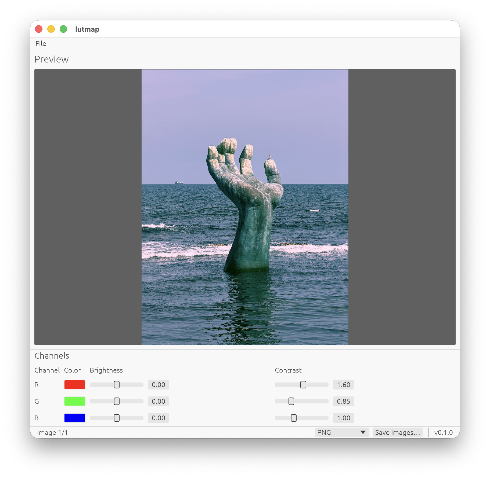

# lutmap
`lutmap` is a minimalistic, lightweight image viewer and per-channel color remapper for common image formats.

It works with most image formats supported by the Rust `image` crate, and provides independent control over each RGB channel, including the options to re-assign pseudocolors, adjust brightness and contrast, and export the adjusted result. Originally, this software was built for fluorescence/confocal microscopy workflows.

The software is lovingly built with `eframe` at its core, with parts of its processing code accelerated with `wgpu`. Generative AI has been used in parts during development, but under human supervision and rigorous cross-checking with API documentation.

---

## Features

- Per-channel color remapping and brightness/contrast adjustment.
- GPU accelerated processing with `wgpu` for supported devices. 

## Usage

### Manual Installation

To install the software manually, you need to have the [Rust](https://rustup.rs/) toolchain, as well as [Git](https://git-scm.com/) available on your device. Once installed, type the following lines into your terminal of choice:

```
git clone https://github.com/leoweoooo/lutmap.git
cd lutmap
cargo run --release
```
